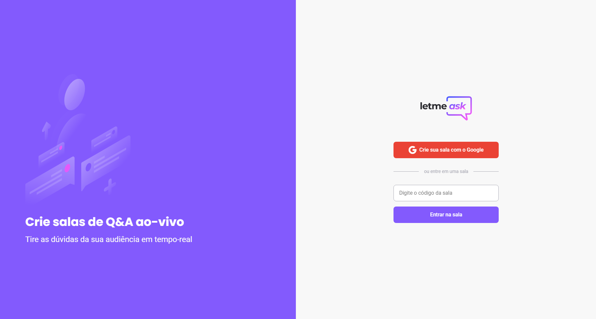

<h1 align="center">
    
</h1>
<h1>
    
</h1>

## 📄 Sobre

O projeto **letmeask** é um sistema proposto e desenvolvido no evento NLW-Together, organizado pela **RocketSeat** em Junho de 2021. O sistema consiste em uma aplicação web, onde os usuários utilizam da criação de salas para efetuar perguntas.

Teste a demo <a href="https://letmeask-6d6cf.web.app">clicando aqui</a><br>
Para acessar as funcionalidades de admin adicione "/admin" na url antes de "/room", como por exemplo: <span style="color: rgb(71, 202, 84)">/admin/rooms/CODIGO_DA_SALA

---

## 📚 Tecnologias Utilizadas

- [ReactJS](https://reactjs.org)
- [Firebase](https://firebase.google.com/?hl=pt)
- [TypeScript](https://www.typescriptlang.org)

---

## 👨‍💻 Como baixar, editar e utilizar

### Certifique-se de ter o **yarn** e o **nodejs** instalado na sua maquina.

Caso não possua essas ferramentas, efetue uma pesquisa rápida dependendo do seu sistema operacional e instale-as. (fique tranquilo, é rapido e fácil 😎)

```bash
#Clone o repositório
$ git clone https://github.com/dpavlak/Letmeask.git

# Acesse o local onde você fez a clonagem
$ cd letmeask-nwl

# Instale as dependências
$ yarn install

# É necessario configurar o SDK do Firebase
    - Acesse o site do firebase, faça o login com sua conta
    - Crie um novo projeto com o nome que você preferir.
    - Na aba de autenticação, ative a autenticação com contas Google.
    - Na aba "Realtime Database" crie um novo banco de dados.
    - Registre esse banco para ser utilizado como uma aplicação web
      em "visão geral do projeto".
    - Agora basta esperar, e, prontinho! Logo em seguida seram
      disponibilizadas as informações que precisamos.

# Siga o modelo do arquivo .env.example
# Preencha os campos com suas respectivas informações do seu banco
# Altere o nome do arquivo para .env.local

# Execute a aplicação
$ yarn start
```

---

## ✅ Done

Você já está com o código fonte e toda a aplicação em suas mãos.
Enjoy! 😊
